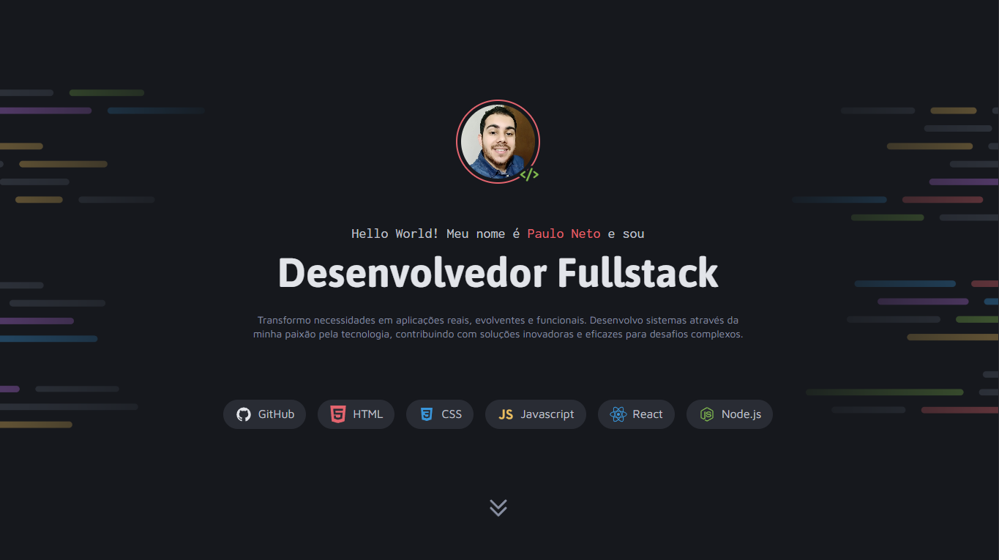

# Portfolio Dev - Paulo Neto



> Desenvolvedor Fullstack criando soluções digitais inovadoras e funcionais

## 🚀 Sobre o Projeto

Este é o meu portfólio profissional como Desenvolvedor Fullstack. Um projeto moderno e responsivo que showcase minhas habilidades técnicas e projetos desenvolvidos, construído com as melhores práticas do mercado para demonstrar minha capacidade de criar aplicações web completas e escaláveis.

## 🛠️ Stack de Tecnologias

### Frontend

- **HTML5** - Estrutura semântica e acessível
- **CSS3** - Estilização moderna com CSS Grid e Flexbox
- **JavaScript** - Lógica e interatividade
- **Design Responsivo** - Adaptável para todos os dispositivos

### Ferramentas e Práticas

- **Git** - Controle de versão
- **Metodologia BEM** - Organização de CSS
- **Otimização de Performance** - Imagens otimizadas e código limpo
- **SEO** - Boas práticas para mecanismos de busca

## 📁 Estrutura do Projeto

```
Portfolio-Dev/
├── assets/
│   ├── icons/           # Ícones de tecnologias e redes sociais
│   ├── images/          # Thumbnails dos projetos
│   ├── preview.png      # Preview do projeto
│   ├── neto.jpg         # Foto de perfil
│   └── Background_*.png # Imagens de fundo
├── styles/
│   ├── global.css       # Variáveis e estilos globais
│   ├── index.css        # Estilos principais
│   ├── intro.css        # Seção introdutória
│   ├── projects.css     # Galeria de projetos
│   ├── services.css     # Seção de serviços
│   ├── contact.css      # Seção de contato
│   └── utility.css      # Classes utilitárias
└── index.html           # Página principal
```

## 🌟 Funcionalidades

### ✨ Design e UX

- **Interface Moderna** - Design limpo e profissional com gradientes e animações suaves
- **Totalmente Responsivo** - Experiência perfeita em desktop, tablet e mobile
- **Navegação Intuitiva** - Interface amigável com transições fluidas
- **Acessibilidade** - Semântica HTML5 e boas práticas de acessibilidade

### 🎨 Seções Principais

- **Apresentação Profissional** - Introdução com foto de perfil e habilidades principais
- **Galeria de Projetos** - 6 projetos em destaque com thumbnails e descrições
- **Serviços Oferecidos** - Desenvolvimento web, APIs e DevOps
- **Contato e Redes Sociais** - Links diretos para LinkedIn, Instagram, GitHub e e-mail

### 🚀 Performance

- **Carregamento Rápido** - Imagens otimizadas e CSS eficiente
- **Código Limpo** - Estrutura organizada e comentada
- **Compatibilidade** - Funciona nos principais browsers modernos

## 💼 Projetos em Destaque

1. **Travelgram** - Rede social para compartilhamento de viagens
2. **Tech News** - Portal de notícias sobre tecnologia
3. **Página de Receita** - Interface passo a passo para cupcakes
4. **Zingen** - Landing page de aplicativo de karaokê
5. **Refund** - Sistema de pedido e acompanhamento de reembolsos
6. **Página de Turismo** - Guia de viagem para Busan

## 🎯 Objetivo Profissional

Este portfólio foi desenvolvido para demonstrar minhas competências como Desenvolvedor Fullstack, destacando:

- **Soluções Completas** - Desde a concepção até a implementação
- **Foco no Usuário** - Interfaces intuitivas e funcionais
- **Qualidade de Código** - Práticas modernas e manutenibilidade
- **Versatilidade** - Frontend, backend e DevOps

## 🔧 Como Executar

1. **Clone o repositório**

   ```bash
   git clone https://github.com/pNetwo/Portfolio-Dev.git
   cd Portfolio-Dev
   ```

2. **Abra o projeto**

   ```bash
   # Abra o arquivo index.html diretamente no navegador
   # Ou use um servidor local
   python -m http.server 8000
   # ou
   npx serve .
   ```

3. **Acesse**
   ```
   http://localhost:8000
   ```

## 📱 Contato e Redes Sociais

- **📧 E-mail**: paulo_bneto@hotmail.com
- **💼 LinkedIn**: [paulo-neto](https://www.linkedin.com/in/paulo-neto-b967481b6/)
- **🐱 GitHub**: [pNetwo](https://github.com/pNetwo)
- **📷 Instagram**: [@paulo.bnet0](https://www.instagram.com/paulo.bnet0)

## 🌐 Deploy

O projeto está pronto para deployment em plataformas como:

- **Vercel**, **Netlify**, **GitHub Pages** ou qualquer servidor estático.

## 📈 Habilidades Demonstradas

### Hard Skills

- ✅ HTML5 Semântico e Acessível
- ✅ CSS3 Moderno (Grid, Flexbox, Animations)
- ✅ JavaScript (ES6+)
- ✅ Design Responsivo
- ✅ Performance Optimization
- ✅ Git e Versionamento

### Soft Skills

- ✅ **Comunicação Clara** - Documentação detalhada e organizada
- ✅ **Organização** - Estrutura de projeto bem definida
- ✅ **Atenção ao Detalhe** - Interface polida e profissional
- ✅ **Resolução de Problemas** - Soluções criativas e funcionais
- ✅ **Aprendizagem Contínua** - Tecnologias atualizadas

---

## 🤝 Vamos Conversar?

Estou sempre aberto a novas oportunidades e desafios! Se você busca um desenvolvedor apaixonado por tecnologia, focado em resultados e qualidade, entre em contato.

**"Transformo necessidades em aplicações reais, evolventes e funcionais."**

---

_Desenvolvido com ❤️ por [Paulo Neto](https://github.com/pNetwo)_
